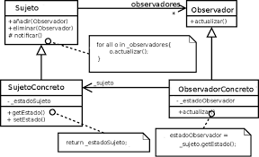

# Patrones
 Patrones
## Qué es un patrón de diseño
Son soluciones generales ya probadas dentro de un contexto que las limita a problemas frecuentes que nos encontramos en el desarrollo de software.

[frase](https://blog.codinghorror.com/head-first-design-patterns/)

## Categorías de patrones de diseño
* **Creational.** Proveen diferentes mecanismos para crear objetos.

* **Structural.** Describen formas de componer objetos para formar nuevas estructuras flexibles y eficientes.

* **Behavioral.** Gestionan algoritmos y responsabilidades entre objetos.

## Behavioral Patterns
### Chain of Responsability
Deacuples a request from a handling object in chain of handlers until it has finally recognized
* Decaupling the sender and receiver objects 
* Receiver contains references to next receiver 
* Promotes loose coupling 
* No hanlder -OK
* Examples
  * java.util.logging.Logger#log()
  * javax.servlet.Filter#doFilter()
  * Spring Security Filter Chain
* Design
  * Chain of receiver objects
  * Handler is Interface based
  * Concrete handler for each implementation
  * Each handler has a reference to the next
  * Handler, ConcreteHandler
* Pitfalls
  * Handling/Handler guarantee
  * Runtime configuration risk
  * Chain length/performance issues
* Contrast

| Chain of Responsability         | Command | 
| --------------------------------|:-------:| 
| Handler is unique               | Command also unique|
| successor | Encapsulates function|
| Can utilize the command         | Reversible or Trackable in nature|

### Command
### Interpreter
### Iterator
### Mediator
### Memento
### Observer 
El patrón observer se compone de un sujeto que ofrece mecanismos de suscripción y desuscripción a múltiples observadores que quieren ser notificados de los cambios en dicho sujeto. Cada observador expone un método de update que es usado por el sujeto para notificar cualquier cambio a todos los suscritos.
Es uno de los patrones más utilizados, algunos ejemplos típicos son:
   * Newsletter
   * Sockets
   * Listeners en páginas web

Redux utiliza este patrón. En Event emitter de Js tiene los siguientes métodos:
   * emitter.on = subscribe
   * emitter.off = unsubcribe
   * emitter.emit = notife

### State
### Strategy
### Template Method
### Visitor

## Creational Patterns
### Abstract Factory
### Builder
Es usado para permitir la creación de una variedad de objetos complejos desde un objeto fuente. Separa la creación de un objeto complejo de su estructura, de tal forma que el mismo proceso de construcción puede servir para crear representaciones diferentes
### Factory Method
### Prototype
### Singleton
Es un patrón que te asegura que una clase solo tiene una instancia. Esta única instancia puede ser consumida por cualquier otro objeto.
* Only one instance created
* Guarantees control of a resource
* Lazily loaded
* Examples:
  * Runtime
  * Logger
  * Spring Beans
  * Graphic Managers
#### Design
* Class is responsible for lifecucle
* Static in nature
* Needs to be thread safe
* Private instance
* Private constructor
* No parameters required for constructor
#### Pitfalls
* Often overused, If you make everything a singletton, it will slow your app
* Difficult to unit test because everything is private
* If not careful, no thread-safe
* Cometimes confused for Factory
* java.utils.Calendar is NOT a Singleton( Rpototype)

#### Contrast
| Singleton                       | Factory | 
| --------------------------------|:-------:| 
| Returns same instance           | Returns various instances|
| One constuctor method - no args | multiples constructors|
| No interface                    | Interface driven|
| | Adaptable to environment more easily

 Moongose te trae una sola instancia, la cachea peo siempre te trae una sola instancia