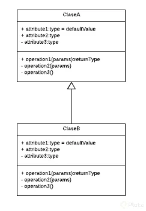

# Programación orientada a objetos
## ¿Qué resuelve la Programación Orientación a Objetos?
La programación Orientada a Objetos nace de los problemas creados por la programación estructurada y nos ayuda a resolver cierto problemas como:

* Código muy largo: A medida que un sistema va creciendo y se hace más robusta el código generado se vuelve muy extenso haciéndose difícil de leer, depurar, mantener.

* Si algo falla, todo se rompe: Ya que con la programación estructurada el código se ejecuta secuencialmente al momento de que una de esas líneas fallara todo lo demás deja de funcionar.

* Difícil de mantener.

Es analizar un problema en forma de objetos para después llevarlo a código, eso es la Orientación a Objetos.

Un **paradigma** es una teoría que suministra la base y modelo para resolver problemas. El paradigma de Programación Orientada a Objetos se compone de 4 elementos:

* Clases
* Propiedades
* Métodos
* Objetos
Y 4 Pilares:

* Encapsulamiento
* Abstracción
* Herencia
* Polimorfismo

## Lenguajes Orientados a Objetos
Algunos de los lenguajes de programación Orientados a Objetos son:

Java:
– Orientado a Objetos naturalmente
– Es muy útilizado en Android
– Y es usado del lado del servidor o Server Side
PHP
– Lenguaje interpretado
– Pensado para la Web
Python
– Diseñado para ser fácil de usar
– Múltiples usos: Web, Server Side, Análisis de Datos, Machine Learning, etc
Javascript
– Lenguaje interpretado
– Orientado a Objetos pero basado en prototipos
– Pensado para la Web
C#
Ruby
Kotlin

Plugins:
Debugger for Java
Java Extension Pack
## Diagramas de Modelado
**OMT:** Object Modeling Techniques. Es una metodología para el análisis orientado a objetos.

**UML:** Unified Modeling Language o Lenguaje de Modelado Unificado. Tomó las bases y técnicas de OMT unificándolas. Tenemos más opciones de diagramas como lo son Clases, Casos de Uso, Objetos, Actividades, Iteración, Estados, Implementación.

### Las clases
En la parte superior se colocan los atributos o propiedades, y debajo las operciones de la clase. El primer caractér con el que empiezan es un símbolo que es la visibilidad del atributo o método.

Estos son los niveles de visibilidad que puedes tener:

* `-` private -> solo a nivel de clase
* `+` public -> acceder por todos
* `#` protected -> podrá ser accedido a nivel de paquete de la clase y subclase
* `~` default -> a nivel de clase de paquete, no se puede acceder a nivel de herencia

Una forma de representar las relaciones que tendrá un elemento con otro es a través de las flechas en UML, y aquí tenemos varios tipos, estos son los más comunes:

**Asociación** Como su nombre lo dice, notarás que cada vez que esté referenciada este tipo de flecha significará que ese elemento contiene al otro en su definición. La flecha apuntará hacia la dependencia.

 

 Con esto vemos que la ClaseA está asociada y depende de la ClaseB.

 **Herencia** Siempre que veamos este tipo de flecha se estará expresando la herencia.
La dirección de la flecha irá desde el hijo hasta el padre.

 

Con esto vemos que la ClaseB hereda de la ClaseA

**Agregación** 
Este se parece a la asociación en que un elemento dependerá del otro, pero en este caso será: Un elemento dependerá de muchos otros. Aquí tomamos como referencia la multiplicidad del elemento. Lo que comúnmente conocerías en Bases de Datos como Relaciones uno a muchos.

 

Con esto decimos que la ClaseA contiene varios elementos de la ClaseB. Estos últimos son comúnmente representados con listas o colecciones de datos.

**Composición**
Este es similar al anterior solo que su relación es totalmente compenetrada de tal modo que conceptualmente una de estás clases no podría vivir si no existiera la otra.

 .png![agregacion](../images/uml-relacion-composicion]

## Objetos
Los Objetos son aquellos que tienen propiedades y comportamientos, también serán sustantivos.

Pueden ser Físicos o Conceptuales
Las Propiedades también pueden llamarse atributos y estos también serán sustantivos. Algunos atributos o propiedades son nombre, tamaño, forma, estado, etc. Son todas las características del objeto.

Los Comportamientos serán todas las operaciones que el objeto puede hacer, suelen ser verbos o sustantivos y verbo. Algunos ejemplos pueden ser que el usuario pueda hacer login y logout.

Una **Clase** es el modelo por el cual nuestros objetos se van a construir y nos van a permitir generar más objetos.

Analizamos Objetos para crear Clases. Las Clases son los modelos sobres los cuales construiremos nuestros objetos.

**Abstracción** es cuando separamos los datos de un objeto para generar un molde.

## Modularidad
La modularidad va muy relacionada con las clases y es un principio de la Programación Orientado a Objetos y va de la mano con el Diseño Modular que significa dividir un sistema en partes pequeñas y estas serán nuestros módulos pudiendo funcionar de manera independiente.

La modularidad de nuestro código nos va a permitir

Reutilizar
Evitar colapsos
Hacer nuestro código más mantenible
Legibilidad
Resolución rápida de problemas
Una buena práctica es separando las clases en archivos diferentes.

## ¿Qué es la herencia?
Don’t repeat yourself es una filosofía que promueve la reducción de duplicación en programación, esto nos va a inculcar que no tengamos líneas de código duplicadas.

Toda pieza de información nunca debería ser duplicada debido a que incrementa la dificultad en los cambios y evolución

La herencia nos permite crear nuevas clases a partir de otras, se basa en modelos y conceptos de la vida real. También tenemos una jerarquía de padre e hijo.

https://github.com/anncode1/Curso-POO-Platzi/tree/6.Polimorfismo/Java

* JS Uno de los beneficios de utilizar este nuevo estándar que ejecutar herencia es tan simple como utilizar la palabra reservada extends. `class UberVan extends Car`
* Java  `class UberBlack extends Car`

## Encapsulamiento
El Encapsulamiento es hacer que un dato sea inviolable, inalterable cuando se le asigne un modificador de acceso.

