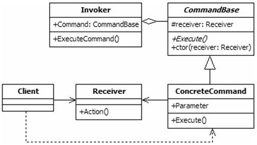
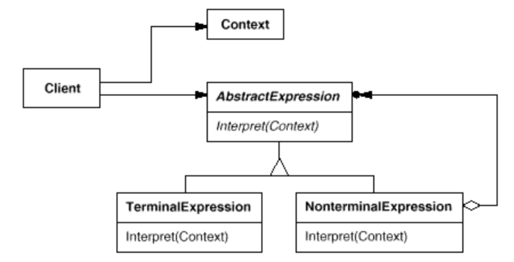
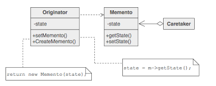
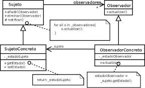
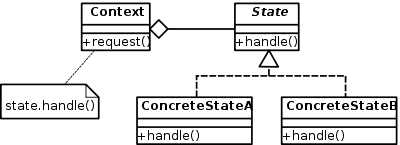
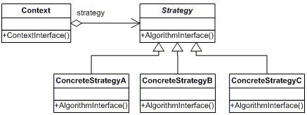
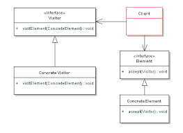
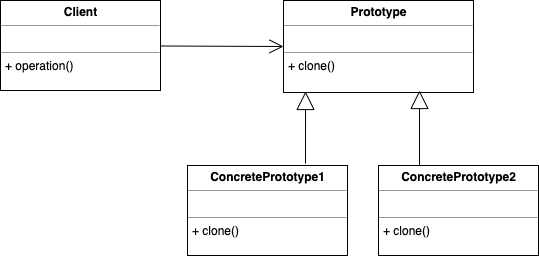
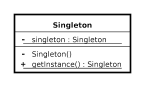

# Patrones
 Patrones
## Qué es un patrón de diseño
Son soluciones generales ya probadas dentro de un contexto que las limita a problemas frecuentes que nos encontramos en el desarrollo de software.

[frase](https://blog.codinghorror.com/head-first-design-patterns/)

## Categorías de patrones de diseño
* **Creational.** Proveen diferentes mecanismos para crear objetos.

* **Structural.** Describen formas de componer objetos para formar nuevas estructuras flexibles y eficientes.

* **Behavioral.** Gestionan algoritmos y responsabilidades entre objetos.

## Behavioral Patterns

### Chain of Responsability
Deacuples a request from a handling object in chain of handlers until it has finally recognized
#### Concepts
* Decaupling the sender and receiver objects 
* Receiver contains references to next receiver 
* Promotes loose coupling 
* No hanlder -OK
* Examples
  * java.util.logging.Logger#log()
  * javax.servlet.Filter#doFilter()
  * Spring Security Filter Chain
####  Design
* Chain of receiver objects
* Handler is Interface based
* Concrete handler for each implementation
* Each handler has a reference to the next
* Handler, ConcreteHandler
####  Pitfalls
* Handling/Handler guarantee
* Runtime configuration risk
* Chain length/performance issues
####  Contrast

| Chain of Responsability         | Command | 
| --------------------------------|:-------:| 
| Handler is unique               | Command also unique|
| successor | Encapsulates function|
| Can utilize the command         | Reversible or Trackable in nature|

### Command
* The second pattern more used
* Enapsulate each requst as an object
* Decouple sender from processor
* Very few drawbacks
* Often used for undi functionality



#### Concepts
* Encapsulate request as an Object
* Object-oriented callback
* Decouple sender from processor
* Often used for "undo" funcionality
* Examples: 
    * java.lang.Runnable
    * javax.swing.Action
####  Design
* Object per command,command usually is a verb
* Command Interface, all implementation will do thi interface
* Execute method
* 'Unexecute' method
* Reflection
* Command, Invoker, ConcreteCommand

#### Pitfalls
* Dependence n other patterns
* Multiple commands
* Make use of Memento
* Prototype for copies

#### Contrast

| Command            | Strategy            | 
|:------------------:| :-----------------: | 
| Object per command | Object per strategy |
| Class contains the `what` | Class contain the `how`|
| Encapsulates action| Encapsulates algorithm |

### Example 
``` java
Task task1 = new Task(10, 12);
Task task2 = new Task(11, 13);

Thread thread1 = new Thread(task1);
thread1.start(); 

Thread thread2 = new Thread(task2);
thread2.start(); 

```

### Interpreter
* Define grammar
* Rules or valiation
* Special case pattern
* Consider the visitor

#### Concepts
* Repreent grammar
* Interpreter a senence
* Map a domain
* AST
* Examples:
  * java.util.Pattern
  * java.text.Format

####  Design
* AbstractExpresion
* Interpreter
* TerminalExpression
* NomterminalExpression
* Context, AbstractExpression, TerminalExpression, NonterminalExpression, Client



#### Pitfalls
* Complexity, is the grammar is complex, difficult to mantain
* Class per rule, New Expression, new class
* Use of other patterns
* Adding new variant
* Specific case

#### Contrast
| Interpreter            | Visitor            | 
|:----------------------:| :-----------------: | 
| Access to properties   | Needs Observer functionality |
| Function as methods    | Functionality found in one place |
| Adding new functionality changes every variant| Adding new variant requires changing every visitor |


### Example
```java
String input = "Lion, and trigers, and bears!";

Pattern p = Pattern.compile("lion|cat|wolf|bear|tiger|liger");

Matcher m = p.matcher(input);

while(m.find()){
  System.out.println("Found a " + m.group() + ".");
}
```


### Iterator
* Efficent way to traverse
* Hide algorthm
* Simplify client
* Foreach

#### Concepts
* Traverse a container
* Doesn't expose underlying sctructure
* Decouples algorithms
* Sequential
* Examples:
  * java.util.Iterator
  * java.util.Enumeration

#### Design
* Interface based
* Factory Method based
* Inependent, but fail fast
* Enumeratos are fail safe
* Iterator, ConcreteIterator

#### Pitfalls
* Access to index
* Directional
* Speed/ Efficiency

#### Contrast
| Iterator            | For loop            | 
|:-------------------:| :-----------------: | 
| Interface based     |  Traversal in client |
| Algorithm is removed | Exposes and index |
| No index| Doesn't change underlying object|
| Concurrent modification | foreach syntax |
| | Typically slower |

#### Example

```java
List <String> names = new ArrayList<>();

names.add("Bryan");
names.add("Aaron");
names.add("Jason");

Iterator <String> namesItr = names.iterator();

while(namesItr.hasNext()) {
  String name = namesItr.next();
  System.out.println(name);
  namesItr.remove();
}
```

### Mediator
* Loose coupling
* simplified communication
* Mediator complexity
* Use with command

#### Concepts
* Loose coupling
* Wel-defined, but complex
* Reusable components
* Hub/ Router
* Examples
  * java.util.Timer
  * java.lang.Method#invoke()

####  Design
* Interface based
* Concrete class
* Minimizes inheritance
* Mediator knows about colleagues
* Mediator, ConcreteMediator


#### Pitfalls
* Deity object
* Limits subclassing
* Over or with Command

#### Contrast
| Mediator            | Observer            | 
|:-------------------:| :-----------------: | 
| Defines interaction | One to many |
| Object decoupling   | Object decoupling |
| More specific       | More generic |

#### Example
```java
 public MediatorEverydayDemo(int seconds){
        toolkit = Toolkit.getDefaultToolkit();
        timer = new Timer();
        timer.schedule(new RemindTask(), seconds * 1000);
        timer.schedule(new RemindTaskWithoutBeep(), seconds * 2 *  1000);
    }

    class RemindTask extends TimerTask {
        @Override
        public void run() {
            System.out.println("Time's up!");
            toolkit.beep();
        }
    }
```

### Memento
* Capture state
* Can get heavy with history
* Recreate state
* Command

#### Concepts
* Restore Object to pevious state
* Externalize internal state
* Undo/Rollback
* Shiels complex internals
* Examples:
  * java.util.Date
  * java.io.Serializable

####  Design
* Class based
* Originator, create the memento
* Carataker, what manages the copy the memento create
* Memento
* Magic Cookie




#### Pitfalls
* Can be expensive
* Deletes/history
* Exposing information


#### Contrast
| Memento           | Command            | 
|:-----------------:| :-----------------: | 
| State captured    | Request captured |
| Independent state | Independent request |
| Caretaker/History | History side benefit |

#### Example

```java
Employee emp = new Employee();
        emp.setName("Joe");
        emp.setAddress("Calle illescas 34");
        emp.setPhone("555666555");
        
        serialize(emp);

        Employee newEmp = deserialize();
```

### Observer 
El patrón observer se compone de un sujeto que ofrece mecanismos de suscripción y desuscripción a múltiples observadores que quieren ser notificados de los cambios en dicho sujeto. Cada observador expone un método de update que es usado por el sujeto para notificar cualquier cambio a todos los suscritos.
Es uno de los patrones más utilizados, algunos ejemplos típicos son:
   * Newsletter
   * Sockets
   * Listeners en páginas web



Redux utiliza este patrón. En Event emitter de Js tiene los siguientes métodos:
   * emitter.on = subscribe
   * emitter.off = unsubcribe
   * emitter.emit = notife

* Decoupled communication
* Built in functionality
* Used with mediator

#### Concepts
* One to many
* Decoupled
* Event hanling
* Pub/sub
* M-V-C
* Examples:
  * java.util.Observer
  * java.util.EventListener
  * javax.jms.Topic

#### Design
* Subject
* Observer
* Observable
* Views are Observer
* Subject, Concrete Subject, Observe, Concret Observer

#### Pitfalls
* Unexpected upates
* Large sized consequences
* What changed
* Debugging difficult

#### Contrast
| Observer           | Mediator            | 
|:-----------------:| :-----------------: | 
| One-t-many    | One-to-one-to-Many |
| Decoupled| Decoupled |
| Broadcast Communication | Complex Communication |


#### Examples

```java
TwitterStream messageStream = new TwitterStream();
Client client1 = new Client("John");
Client client2 = new Client("Bran");

messageStream.addObserver(client1);
messageStream.addObserver(client2);

messageStream.someoneTweeted();
```


### State
Represente stae  in an app
* Simplifies cyclomatic complexity
* Adding addditional states made easier
* More classes
* Similar implementation to Strategy


#### Concepts
* Localize state behavior
* State object
* Separates what from where
* OCP
* Examples
  * JSF, iterator?

####  Design
* Abstract Class/ interface
* Class based
* Context unaware
* Context, state, concreteState




#### Pitfalls
* Know your states
* More classes
* Keep ogic out of context
* State change triggers

#### Contrast
| State           | Strategy            | 
|:-----------------:| :-----------------: | 
| Interface base    | Interface based |
| Transitions | Algorithm are independent |
| Class per state  | Class per Algorithm|
| know the next step  | don't know the next step |

#### Examples

```java
final static int ON = 0;
final static int OFF = 1;
int state = OFF;

public void pullChain() {
    if (state == ON){
        System.out.println("Fan is already on");
    }
    else if (state == OFF){
        System.out.println("Turning Fan on.");
        state = ON;
    }
}
```

### Strategy
 Enable the algorithm in runtime
* Externalize algorithms
* Client knows different Strategies
* Class per strategy
* Reduces conditional statements

#### Concepts
* Eliminate conditional statements
* Behavior encapsulated in classes
* Difficult to add new strategies
* Client aware of strategies
* Client chooses strategy
* Examples
  * java.util.Comparator

####  Design
* Abstract base class
* Concrete class per strategy
* Removes if/else conditionals
* Strategies are independent
* Context, Strategy, ConcreteStrategy




#### Pitfalls
* Client aware of Strategies
* Increased number of classes

#### Contrast

| State           | Strategy            | 
|:-----------------:| :-----------------: | 
| Interface based    | Interface based |
| Transitions | Algorithm are independent |
| Class per state  | Class per Algorithm |
| know the next step  | don't know the next step |

#### Examples
```java
  Collections.sort(people, new Comparator<Person>() {
      @Override
      public int compare(Person o1, Person o2) {
          if (o1.getAge() > o2.getAge()) {
              return 1;
          }
          if (o1.getAge() < o2.getAge()) {
              return -1;
          }
          return 0;
      }
  });
```

### Template Method
* Guarantees Algoruthm adherence
* Ioc
* Easier implementation

#### Concepts
* Code reuse
* Common in libraries/frameworks
* IoC
* Algorithm emphasis
* Examples:
  * java.util.Collections#sort()
  * java.util.AbstractList#IndexOf()

####  Design 
* Abstract Base class
* Base calls Child
* Hooks
* Operations
* AbstractBase, ConcreteClass

#### Pitfalls
* Restrict access
* Confusing hierarchy
* Difficult Program flow

#### Contrast
| Template method   | Strategy            | 
|:-----------------:| :-----------------: | 
| Same algorithm    | Algorithm per Strategy |
| Class based       | Interface based |
| Compile time      | CRun time |

#### Examples
```java
  Collections.sort(people, new Comparator<Person>() {
      @Override
      public int compare(Person o1, Person o2) {
          if (o1.getAge() > o2.getAge()) {
              return 1;
          }
          if (o1.getAge() < o2.getAge()) {
              return -1;
          }
          return 0;
      }
  });
```


### Visitor
Separate algorithm from object structure
* Expect changes
* Minor complexity
* Externalizes change


#### Concepts
* Separate algorithm from object
* Adding new features
* Maintain Open/Closed principle
* Visitor changes
* Examples:
  * java.lang.model.element.Element
  * java.lang.model.element.ElementVisitor

#### Design
* Interface based
* Visitor and Element
* Elements have visit method
* Visitor knows every Element
* Visitor, ConcreteVisitor, Element, ConcreteElement.




#### Pitfalls
* Plan for adaptability
* Indirection somewhat confusing
* Adapter pattern

#### Contrast

| Visitor   | Iterator            | 
|:-----------------:| :-----------------: | 
| Interfaced based | Interfaced based/ Anonymous|
| Externalized changes | Encapsulates |
| Multiple visitors | Singular |
#### Examples
```java
public class VisitorEverydayDemo {
    public static void main(String[] args) {
        PartsOrder order = new PartsOrder();
        order.addPart(new Wheel());
        order.addPart(new Fender());
        order.addPart(new Oil());
        
        order.accept(new AtvPartsShippigVisitor())
    }
}
```

## Creational Patterns

### Builder
Es usado para permitir la creación de una variedad de objetos complejos desde un objeto fuente. Separa la creación de un objeto complejo de su estructura, de tal forma que el mismo proceso de construcción puede servir para crear representaciones diferentes.

//with setter the builder is ot inmutable with setter is a bean model


* Creative way to deal with complexity
* Easy to implement
* Few drawbacls
* Can refactor in with separate class

#### Concepts
  * Handles complex constructors
  * Large number of parameters
  * Immutability
  * Examples:
    * StringBuilder
    * DocumentBuilder
    * Locale.Builder

#### Designs
* Flexibility over telescoping constructors
* Static inner class
* Calls appropriate constructor
* Negates the need for exposer setters
* Java 1.5+ can take advantage of generics

#### Pitfalls
 * Immutable
 * Inner static class
 * Designed first
 * Complexity

 #### Contrast
| Builder                       | Prototype | 
| --------------------------------|:-------:| 
| Handles complex constructors          | Implemented around clone|
| No interface required | Avoids calling complex|
| Can be a separate class                    | Difficult to implement in legacy code|
| Works with legacy code | |


### Factory Method
* Parameter driven
* Solves complex creation
* A little complex
* Opposite of a Singleton

#### Concepts
* Doesn't expose instantiation logic
* Defer to subclases
* Common to subclasses
* Specified by architecture, implemented by user
* Examples:
  * Calendar
  * ResourceBundle
  * NumberFormat

####  Design
* Factory is responsible for lifecycle and is the opposite of singletton.
* Objects created are referenced through a common interface
* Factories will also reference multiple concrete classes or implementation, but the client is unware since they are references through the common interface
* The method to request an object is typicalle parameterized. These parameters are what are used to determine the concrete type

#### Pitfalls
* Complexity,
* Creatin in subclass
* Refactoring

#### Contrast
| Singleton                       | Factory | 
| --------------------------------|:-------:| 
| Returns same instance           | Returns various instances|
| One constuctor method - no args | multiples constructors|
| No interface                    | Interface driven|
| No subclasses                   | Subclasses | 
| | Adaptable to environment more easily |

### Prototype

* Guarantee unique instance
* Often refactored in
* Can help with performance issues
* Don't always jump to a Factory

#### Concepts
* Avoids costly cretion
* Avoids subclassing
* Typlically doesn't use "new"
* Usually implemented with a Registry
* Example Java.lang.Object#clone()

#### Design
* Clone / Cloneable
* Avoids keyword "new"
* Although a copy, each instance unique
* Costly construction not handled by client
* builder is the opposite of the prototype
* We can stille utilize parameter for constructor, diferent from singletton
* Shallow vs Deep Copy, Shallow copy just copies the immediate properties, whereas a deep copy will copy any of its object references as well




#### Pitfalls
* Sometimes not clear when to use
* Used with other patterns
  * Registry
* Shallow vs Deep copy 

#### Contrast
| Prototype                       | Factory | 
| --------------------------------|:-------:| 
| Ligther weigth contruction      | Flexible Objects|
|  *Copy constructor or clone* | *Multiple constructors*|
| Shallow or deep                    | Concrete instance|
| Copy itself| Fresh instance |


### Abstract Factory

Similar to Factory pattern
If you have the same query for db you can use it for diferent kind of db
* Group of similar factories
* Complex
* Heavy abstraction. interfaces, subclasses
* Framework pattern

#### Concepts
* Factory of Factories, can be implemented without using the factory pattern, more often it not
* Factory of related objects
* Common interface 
* Defer to subclasses as weel
* Examples, Document builder, is used more often in fw

####  Design
* Groups factories together
* Factory is respondible for lifecycle
* Common interface
* Concrete Classes
* Parameterized create method
* Composition

#### Pitfalls
* Complexity, difucult to implement
* Runtime switch
* Pattern within a pattern
* Problem specific
* Starts as a Factory

#### Contrast
| Factory                   | AbstractFactory |
|:-------------------------:| :--------------:| 
| Returns various instances | Implemented with a Factory |
| multiples constructors    | Hides the Factory |
| Interface driven          | Abstract Environment |
| Adaptable to environment more easily | Built through composition|


### Example
``` java
 DocumentBuilderFactory abstractFactory = DocumentBuilderFactory.newInstance();

 DocumentBuilder factory = abstractFactory.newDocumentBuilder();

 Document doc = factory.parse(bais);
```


### Singletton
Es un patrón que te asegura que una clase solo tiene una instancia. Esta única instancia puede ser consumida por cualquier otro objeto.
#### Concepts
* Only one instance created
* Guarantees control of a resource
* Lazily loaded
* Examples:
  * Runtime
  * Logger
  * Spring Beans
  * Graphic Managers
#### Design
* Class is responsible for lifecucle
* Static in nature
* Needs to be thread safe
* Private instance
* Private constructor
* No parameters required for constructor
#### Pitfalls
* Often overused, If you make everything a singletton, it will slow your app
* Difficult to unit test because everything is private
* If not careful, no thread-safe
* Cometimes confused for Factory
* java.utils.Calendar is NOT a Singleton( Rpototype)

#### Contrast
| Singleton                       | Factory | 
| --------------------------------|:-------:| 
| Returns same instance           | Returns various instances|
| One constuctor method - no args | multiples constructors|
| No interface                    | Interface driven|
| | Adaptable to environment more easily |

 


Moongose te trae una sola instancia, la cachea peo siempre te trae una sola instancia