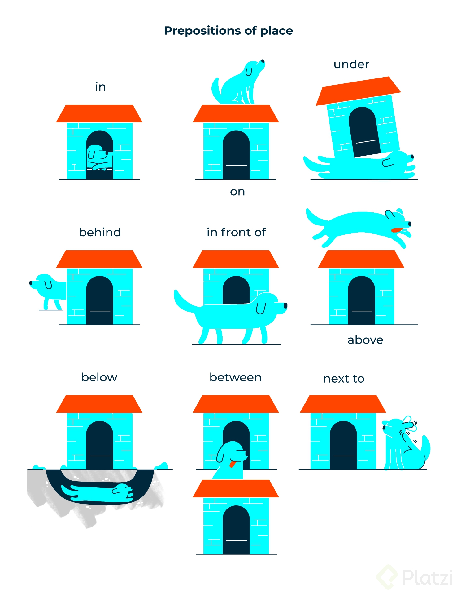

My email address is j@y.com you can reply back here.
Can you repeat that?
Can you speak slowly please?
How do you spell that?
What is the meaning of ___________ ?

Have got is a synonym of have and it is used in very informal communication.

### Plural nouns

| regular nouns | Ends in ss, ss, ch, sh,x or z | Ends in F and FE |
| ------------- |:-----------------------------:| ----------------:|
| 1car -2cars   | 1bus-2buses 1match - 2matches | 1 leaf - 3 leaves|
| 1dog - 3dogs  | dish-dishes quiz-quizzes      | 1 wolf - 3 wolves|

| Ends in vowel +y Add s| Ends in consonant + y   | Irregular pluals |
| --------------------- |:-----------------------:| ----------------:|
| day -days             | city-cities | man-men woman- women|
| key -keys             | baby-babies | foot- feet mouse-mice child- children|

### Prepositions of places :dog:

 

