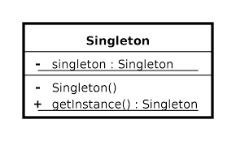

# Patrones
## Qué es un patrón de diseño
Son soluciones generales ya probadas dentro de un contexto que las limita a problemas frecuentes que nos encontramos en el desarrollo de software.

[frase](https://blog.codinghorror.com/head-first-design-patterns/)

## Categorías de patrones de diseño
* **Creacionales.** Proveen diferentes mecanismos para crear objetos.

* **Estructurales.** Describen formas de componer objetos para formar nuevas estructuras flexibles y eficientes.

* **De Comportamiento.** Gestionan algoritmos y responsabilidades entre objetos.

## Patrones Creacionales
### Abstract Factory
### Builder
Es usado para permitir la creación de una variedad de objetos complejos desde un objeto fuente. Separa la creación de un objeto complejo de su estructura, de tal forma que el mismo proceso de construcción puede servir para crear representaciones diferentes
### Factory Method
### Prototype
### Singleton
Es un patrón que te asegura que una clase solo tiene una instancia. Esta única instancia puede ser consumida por cualquier otro objeto.

 

 Moongose te trae una sola instancia, la cachea peo siempre te trae una sola instancia

## Patrones estructurales

### Adapter
### Bridge
### Composite
### Decorator
Añade nuevas responsabilidades a un objeto de forma dinámica permitiendo así extender su funcionalidad sin tener que usar subclases.

### Façade
### Flyweight
### Proxy

## Patrones de comportamiento
### Chain of Responsability
### Command
### Interpreter
### Iterator
### Mediator
### Memento
### Observer 
El patrón observer se compone de un sujeto que ofrece mecanismos de suscripción y desuscripción a múltiples observadores que quieren ser notificados de los cambios en dicho sujeto. Cada observador expone un método de update que es usado por el sujeto para notificar cualquier cambio a todos los suscritos.
Es uno de los patrones más utilizados, algunos ejemplos típicos son:
   * Newsletter
   * Sockets
   * Listeners en páginas web

Redux utiliza este patrón. En Event emitter de Js tiene los siguientes métodos:
   * emitter.on = subscribe
   * emitter.off = unsubcribe
   * emitter.emit = notife

### State
### Strategy
### Template Method
### Visitor

## Leyenda 
* `-` privados
* `+` público
* `subrayado` estático
